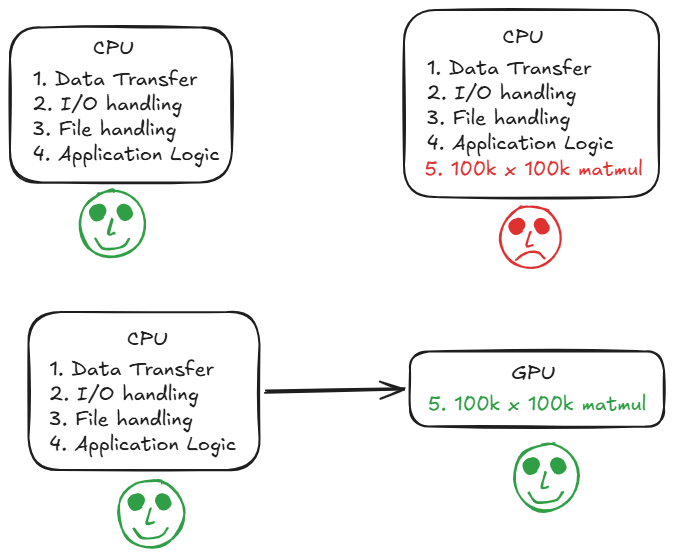

<section class="resume-section">
  <h2>Warm up</h2>
  
With the hype of AI going around for a few years now, no way you haven't heard of GPUs. Bet even your pet has heard it now even if it doesn't get what the three letters even mean. Unless you're already technical, CPU might have taken a back seat in your head.

If CPU is the brain of the computer, GPU is like an extra strong muscle (better to saw a group of smaller muscles) that it decides when to use based on the task at hand. It goes into a PCIe slot just like any other NIC, NVMe SSD etc (preferably a high lanes PCIe slot, given the rate at which it processes data), and makes the system capable of handling more complex tasks much faster. On a regular basis CPUs handle a variety of tasks like running games, file handling, data transfer over the net, playing songs on speakers etc. for desktop CPUs, and massive data transfers, low latency tasks etc for server grade CPUs without breaking a sweat, for which they house small number of super powerful cores for efficient scheduling, to get the work done by its supporting devices, each core going through a lot of the processing sequentially at crazy speeds. High end server grade CPUs would have upto 128 of the beasts handling all tasks almost in parallel.

But using them for massive matrix multiplications, redundant independent operations would be an overkill and not the most optimal, each core loading data from the CPU RAM, doing the operation and repeat for large number of times. With latest advancements in CPUs, for small ML models for training/inference tasks with small matmuls, matrix and vector extensions on each CPU core definitely would give competitive performance and better than paying the overhead of data transfer to GPU, process, and get it back. However, for large AI, gaming graphics, signal processing workloads etc., the CPU can offload it to the GPU asynchronously. Just provide the GPU with the required data and instructions, process other instructions which dont depend on the results from GPU (async), then finally copy the results back from GPU memory to host memory when done and use it however required.

</section>
